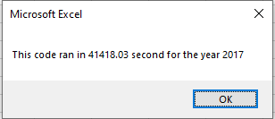

# Stock Analysis

## Overview of Project
Steve, my great friend from college, has just graduated and his parents are his first clients! Steves parents love green enegery so Steve has asked for help in analyizing a group green energy stock (including DAQO the stock that his parents chose for terrible reasons) with the use of VBA.
### Purpose
A inital macro was created, but it needed to be improved for speed quality. The macro gives the results for 12 stocks (and the choice of year). It took longer than expected to run, and if more data was added it would slow down even more.

## Results
The use of the 'tickerIndex' and the arrays created refactored the prior script to make is run more efficiently, and much quicker. 

##Summary

### Adavatages and Disadvantages of Refatcoring Code

### Advatges and Disadvatages of the Original and Refactored VBA Script
