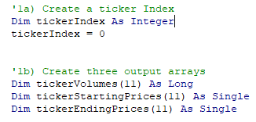
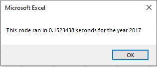

# Steve's Stock Analysis: *Blizzards are good, but lets dig deeper!*

## Overview of Project
Steve, my great friend from college, has just graduated and his parents are his first clients! Steve’s parents love green energy so Steve has asked for help in analyzing a group green energy stock (including DAQO the stock that his parents chose for terrible reasons) with the use of VBA.
### Purpose
An initial macro was created, but it needed to be improved for speed quality. The macro gives the results for 12 stocks (and the choice of year). It took longer than expected to run, and if more data was added it would slow down even more.

## Results
The use of the 'tickerIndex' and the arrays created refactored the prior script to make is run more efficiently, and much quicker. As you can see below in the screen shots, the time it took to run  for the 2017 data was much quicker than the previously used macro.

*Screen shot of index and array coding:*

*Before:*     

  
                        

*After:*

## Summary

### Advantages and Disadvantages of Refactoring Code
In my opinion the Advantages far out-weigh the disadvantages when refactoring code. It is a good exercise to revisit initial code that you have created and challenge yourself to create code that is more efficient. Introducing new skill that you have learned to create a script that runs at a more efficient rate. There is a point where code is as good as it will get, and trying to refactor is just a waste of time.

### Advantages and Disadvantages of the Original and Refactored VBA Script
Again, the original code works so it can be left as is and Steve can continue to use it as needed. But if Steve wants to start using this for other clients and other stocks he may need to expand the stocks reviewed (not just green energy stock). Adding additional stock will slow the original script considerably leading to the advantages of the new code. Using the index (tickerIndex) along with the arrays reads and stores the values from each row in a more efficient way.

